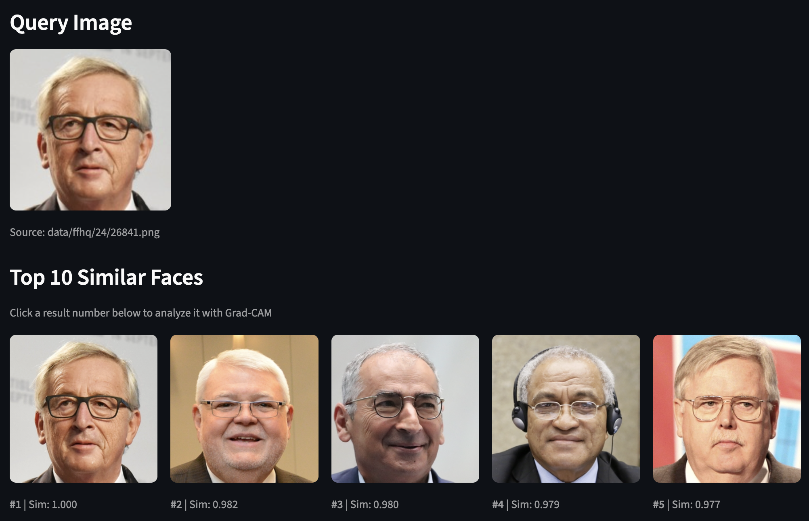
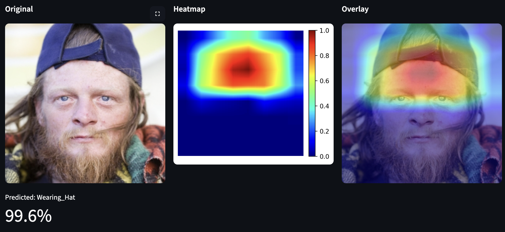

# Face Search & Inpainting

Computer Vision Project - Multi-task learning for face similarity search and semantic inpainting.

---



---

## Features

- **Face Search**: Find similar faces using learned embeddings + FAISS
- **Face Inpainting**: Remove and reconstruct facial features (eyes, nose, mouth)
- **Attribute Prediction**: 40 CelebA binary attributes
- **Grad-CAM**: Visual explanation of encoder attention

Attribute prediction:



Matching attributes:


## Project Structure

```
CV_clone_search/
├── src/
│   ├── data/
│   │   ├── dataset.py        # CelebA & FFHQ loaders
│   │   └── augmentations.py  # albumentations pipeline
│   ├── models/
│   │   ├── encoder.py        # Face encoder (embedding + attributes)
│   │   └── unet.py           # U-Net inpainter
│   ├── training/
│   │   ├── train_encoder.py  # Encoder training script
│   │   └── train_unet.py     # U-Net training script
│   ├── search/
│   │   └── engine.py         # FAISS search engine
│   └── app.py                # Streamlit GUI
├── configs/
│   └── config.yaml           # Hyperparameters
├── data/                     # Datasets (gitignore)
├── checkpoints/              # Model weights
├── runs/                     # TensorBoard logs
└── docs/
    └── Report.md             # Project report
```

## Configuration

Edit `configs/config.yaml`:

```yaml
encoder:
  batch_size: 32
  epochs: 10
  lr: 0.001

unet:
  batch_size: 8
  epochs: 15
  lr: 0.001

data:
  image_size: 256
```

## Requirements

- Python 3.11+
- PyTorch 2.0+
- CUDA (recommended) or MPS (Apple Silicon)
